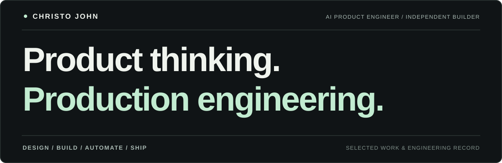
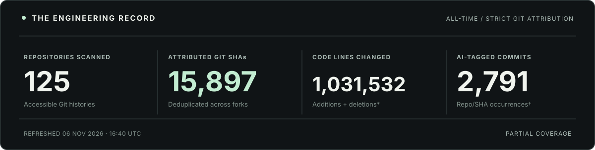

<!-- PREMIUM_PROFILE_DASHBOARD -->

  

<!-- PREMIUM_ACTIONS:START -->

The clickable navigation tiles will appear here.

<!-- PREMIUM_ACTIONS:END -->

 

## The work

I’m **Christo John**, an **AI Product Engineer** working at the intersection of product design, full-stack engineering, and applied AI. I take ideas from **Figma to production**: the interface, data model, integrations, infrastructure, and everything between.

My focus is on making ambitious software practical — clear to use, robust underneath, and ready to ship.

 

## Engineering record

01 / THE NUMBERS, WITH EVIDENCE

<!-- PROFILE_STATS:START -->

  

**15,897 verified-identity Git SHAs** · **1,031,532 code lines changed** · **125 repositories scanned**.

Updated 06 NOV 2026 · 16:40 UTC · Partial — some discovery or fork comparisons require review. Code LOC is cumulative added + deleted programming/markup lines, not unique code written. AI-tagged commits are repository/SHA occurrences, not confirmed autonomous agent-authored commits. Private repository identities are withheld.

**Current language footprint** — **Python** · **TypeScript** · **HTML** · **JavaScript** · **CSS**

[Full methodology &amp; audit](./docs/github-audit/REPORT.md) · [Repository evidence](./docs/github-audit/repositories.md) · [Language history](./docs/github-audit/languages.md) · [AI attribution and definitions](./docs/github-audit/APPENDIX.md)

<!-- PROFILE_STATS:END -->

 

## Selected work

02 / A SMALL SELECTION FROM THE WORKBENCH

<!-- PREMIUM_PROJECTS:START -->

Live project contribution cards will appear here.

<!-- PREMIUM_PROJECTS:END -->

Commit spans are the elapsed calendar time between first and latest attributed Git author dates, not the number of working days. Card statistics count only qualifying Git contributions from the latest strict audit.

 

## The toolkit

03 / FROM PROTOTYPE TO PRODUCTION

**Primary workflow**

`Next.js` &nbsp; `Supabase` &nbsp; `Figma` &nbsp; `Claude Code` &nbsp; `Codex`

**Frontend and product:** TypeScript · React · Tailwind CSS · user experience design

**Backend and data:** Python · Django · PostgreSQL · REST APIs

**Infrastructure and automation:** AWS · Vercel · Docker · Playwright · cloud workflows

**Creative and applied AI:** LLM integrations · Remotion · FFmpeg · agent-assisted engineering

Personal toolkit and experience, not automatically inferred from language statistics. The independently measured language snapshot is in the engineering record above.

 

## A little background

04 / THE PATH HERE

Previously worked across **product engineering and UI design at Neuegrid Design Studio**, and **full-stack development at Tomatrix Technologies**.

Currently pursuing an **MCA (2025–2027)** after completing a **BCA (2022–2025)**. I work across the entire product lifecycle, with a particular interest in design-to-code systems, applied AI, and software that survives real-world edge cases.

 

---

**Good interfaces deserve serious engineering.**

<!-- PREMIUM_FOOTER:START -->

Styled actions will appear here.

<!-- PREMIUM_FOOTER:END -->

Design + data + engineering. Recomputed from verified Git history on every successful audit run.

